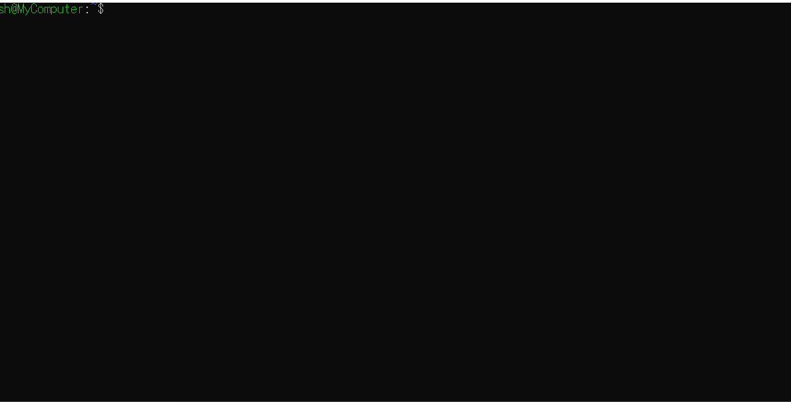

# Sol
## About

Light Web Application Frame Work(developed by C++/Svelte/Stimulus)



## Usage

```
# Create New Sol App!
sol new AppName

# Create New Stimulus Controller
sol generate controller Hoge

# Create New Svelte Component
sol generate component Fuga

# Create New Svelte Routes Component
sol generate route Fuga

# Build App
sol build

# Run Server
sol server
```

# Install

```shell

# Clone This Repo
git clone --recursive https://github.com/S-H-GAMELINKS/sol.git ~/.sol

# Add Path & Restart Bash
echo 'export PATH="$HOME/.sol/bin:$PATH"' >> ~/.bashrc && exec bash
```
